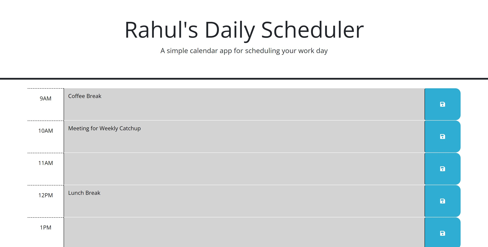

# Daily-Calender

This application allows users to manage project tasks by dynamically updating HTML elements based on the current time and user input. The application uses Day.js for handling dates and times.

Features

Displays time blocks as past, present, or future based on the current hour.

Saves user input for each time block in localStorage.

Allows saving empty blocks within the current hour.

Usage

Open the index.html file in a web browser to view the Task Board application.

Each time block will be color-coded based on whether it's in the past, present, or future.

Enter your task details in the textarea for each time block.

Click the "Save" button to save the task details for that time block.

Tasks will be saved in localStorage and will persist even after refreshing the page.

How It Works

The application dynamically updates the styling of time blocks based on the current hour using Day.js.

User input for each time block is saved in localStorage, allowing users to store and retrieve task details.

Empty blocks within the current hour can also be saved, providing flexibility for managing tasks.

Screenshots

<video controls src="Assets/Functionality.mp4" title="Title"></video>

Code Structure

index.html: Contains the HTML structure for the Task Board application.

script.js: Contains the JavaScript code for updating time blocks, saving user input, and displaying the current date.

Dependencies

Day.js: A minimalist JavaScript library for handling dates and times.

Author

[Your Name]